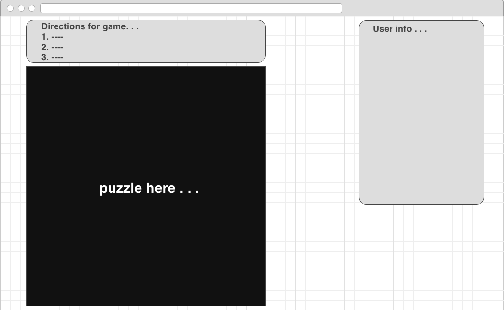
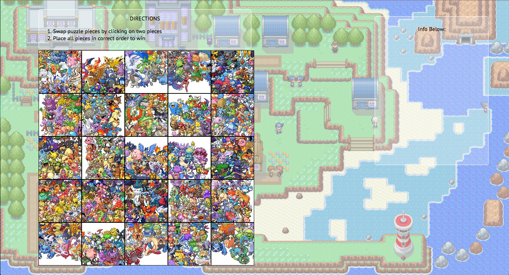
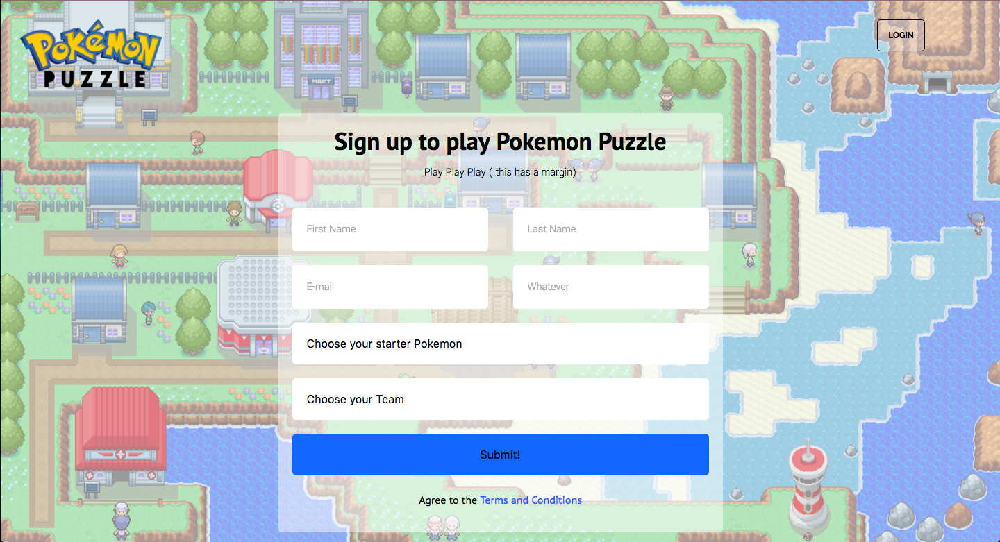
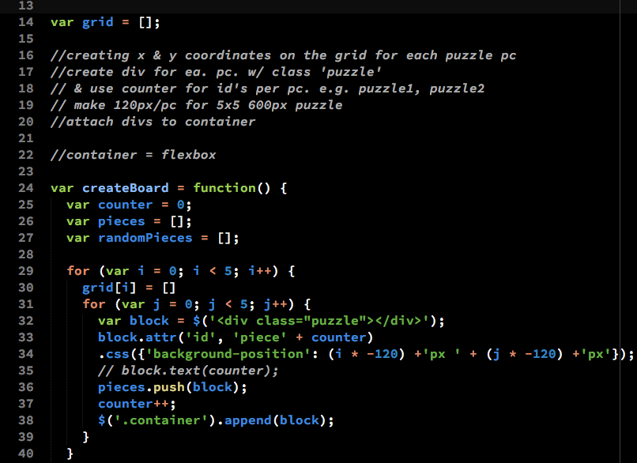

# project-one-game

Pokemon Puzzle Game

DIRECTIONS

1. Submit your info on the landing page
2. Puzzle will appear - 
3. Swap puzzle pieces by clicking 2 puzzle pieces
4. If you place all the pieces to correct location, you win

Above - game page for the Pokemon puzzle

Above - reference landing page

Above - landing page created with layout of reference page

Above - the first portion of code I had trouble with, to create the 
puzzle board with coordinates for all the puzzle pieces. Working with 
nested for loops.

Credits:

♡ Mad help from Scott McCord & Rafa Pacas ♡

Puzzle Image:
http://www.3djuegos.com/foros/tema/1865064/0/cual-es-tu-pokemon-favorito/

Landing Page BG:
http://because-rhysons.tumblr.com/

Puzzle Font 'NOVA' by Billy Argel:
http://billyargel.blogspot.com/
